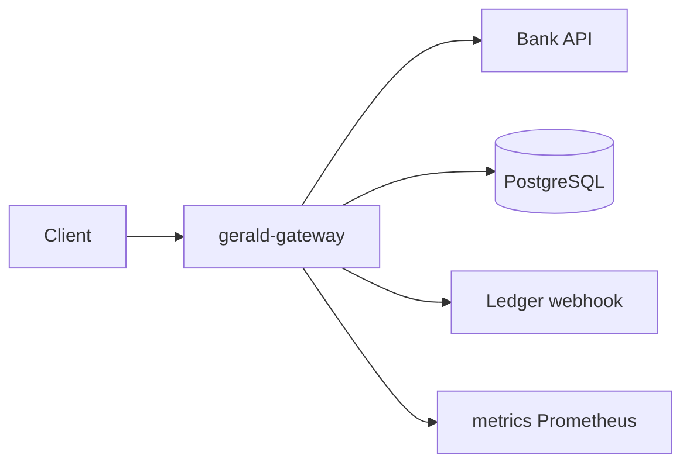

# Gerald BNPL Gateway (`gerald-gateway`)

Microservice that approves Buy Now Pay Later requests for Gerald marketplace shoppers. It pulls 90-day bank history, scores risk, assigns a credit limit, creates a four-installment plan, persists outcomes, and notifies the Ledger via webhook.

## Quick start

```bash
# Mocks only (Bank :8001, Ledger :8002)
make mock-up

# Full stack (Postgres + gateway on :8080)
make stack-up

# Unit + integration tests (no Docker required)
pip install -r gerald-gateway/requirements-dev.txt
make test
```

### Which URL to use?

| How you run the gateway | Decision URL | Bank API (internal) |
|-------------------------|--------------|---------------------|
| **Docker** (`make stack-up`) | `http://localhost:8080/v1/decision` | `http://bank:8000` |
| **Local uvicorn** (e.g. port 8000) | `http://localhost:8000/v1/decision` | `http://localhost:8001` |

Copy `.env.example` → `.env` for local runs. Do **not** use `http://bank:8000` on your Mac — that hostname only exists inside Docker.

Example decision (Docker):

```bash
curl -s -X POST http://localhost:8080/v1/decision \
  -H 'Content-Type: application/json' \
  -d '{"user_id":"user_good","amount_cents_requested":40000}' | jq
```

## Architecture



## Risk model (business view)

Gerald earns when approved users shop in our marketplace. Defaults destroy unit economics. The score (0–100) balances **growth** (approve more qualified users) vs **losses** (filter chronic overdraft / thin-file risk).

### Factors

| Factor | Calculation | Why it matters |
|--------|-------------|----------------|
| **Average daily balance** | Mean end-of-day balance over 90 days; carry forward on quiet days | Liquidity cushion for four biweekly installments |
| **Income vs spend** | Sum(credits) ÷ sum(debits) | >1.0 means net inflows; gig/spend-heavy users trend <0.6 |
| **NSF / negative balance** | Count `nsf: true` and `balance_cents < 0` | Proxies payment stress and overdraft habit |

### Composite score

- Start at **35** baseline points.
- **Balance component (0–35):** $50+ avg → partial credit; $200+ → strong; negative average → 0.
- **Ratio component (0–30):** ≥1.0 full points; stepped down to 0 below 0.55.
- **Stability penalty (0–35):** `4 pts × NSF` + `0.25 × negative-balance tx`, capped at 35.

### Hard declines (regardless of score)

| Rule | Threshold | Rationale |
|------|-----------|-----------|
| Thin file | `< 3` transactions | Cannot infer cash-flow behavior |
| Negative average balance | `< 0` cents | Structurally underwater |
| NSF events | `> 5` | Repeated payment failures |
| Negative-balance transactions | `> 40` | Chronic overdraft pattern |
| Low income/spend | `< 0.50` | Spending far exceeds inflows |

### Credit limit buckets

| Score | Limit |
|-------|-------|
| < 25 | $0 |
| 25–39 | $100 |
| 40–54 | $200 |
| 55–64 | $300 |
| 65–74 | $400 |
| 75–84 | $500 |
| ≥ 85 | $600 |

**Approval:** `amount_granted = min(requested, credit_limit)`; `approved = amount_granted > 0`.

### Test users (expected outcomes @ $400 request)

| User | Outcome | Why |
|------|---------|-----|
| `user_good` | Approved, $600 limit | Positive avg balance, ratio >1, few NSF |
| `user_overdraft` | Declined | 23 NSF, negative avg, ratio 0.33 |
| `user_thin` | Declined | No transaction history |
| `user_gig` | Declined | Negative avg, ratio 0.23 |
| `user_highutil` | Declined | Deep negative avg, ratio 0.36 |

## API

- `POST /v1/decision` — score + persist + webhook on approval
- `GET /v1/plan/{plan_id}` — four installments (14-day cadence)
- `GET /v1/decision/history?user_id=` — prior decisions
- `GET /health`, `GET /metrics`

See `api/openapi.yaml`.

## Observability

**Structured JSON logs** include `request_id`, `user_id`, `event`, `duration_ms`.

**Prometheus metrics** (scraped at `/metrics`):

- `gerald_approved_total`, `gerald_declined_total`
- `gerald_credit_limit_bucket_total{bucket}`
- `service_gerald_gateway_request_duration_seconds`
- `bank_fetch_failures_total`, `webhook_latency_seconds`

Datadog dashboard: `metrics/dashboard_datadog.json`. Map Prometheus names with your agent (e.g. `gerald_approved_total` → `gerald.approved`).

**Terraform alerts:** `terraform/monitors.tf` — error rate and approval-rate drop vs 24h baseline.

## Design choices

1. **Carry-forward daily balances** — Quiet days still reflect last known liquidity (standard in cash-flow underwriting).
2. **Hard declines separate from score** — Product can tune buckets without accidentally approving chronic overdraft users with a middling score.
3. **Webhook retries (3×)** — Ledger delivery is best-effort with persisted `outbound_webhook` rows for replay.
4. **First installment gets remainder** — Avoids penny drift on `/4` split.

